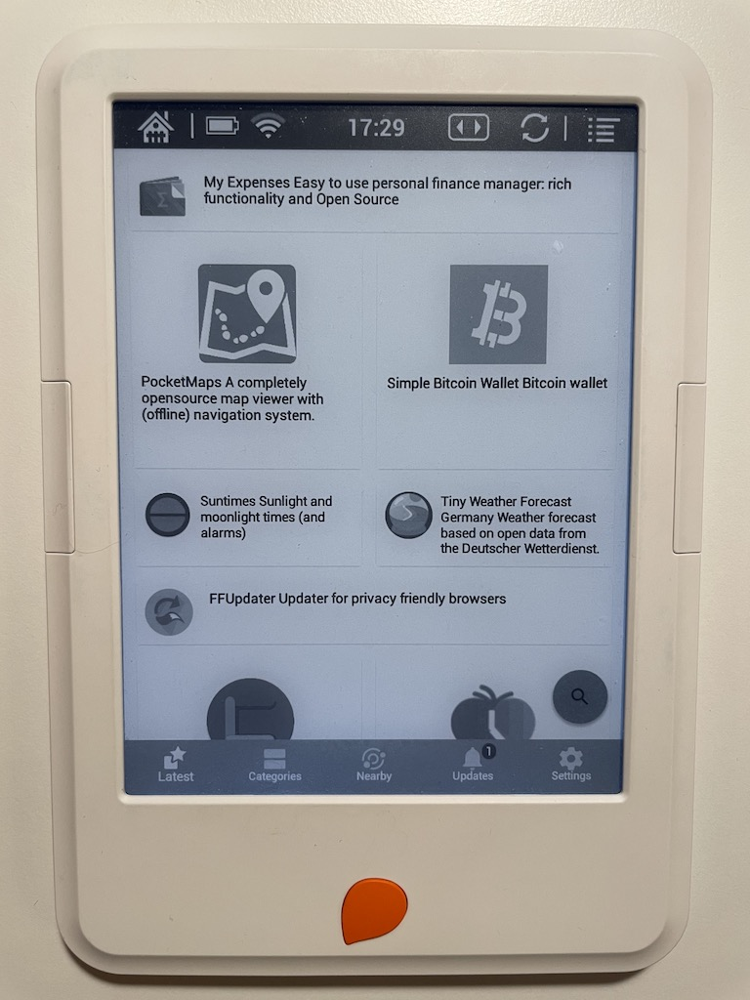
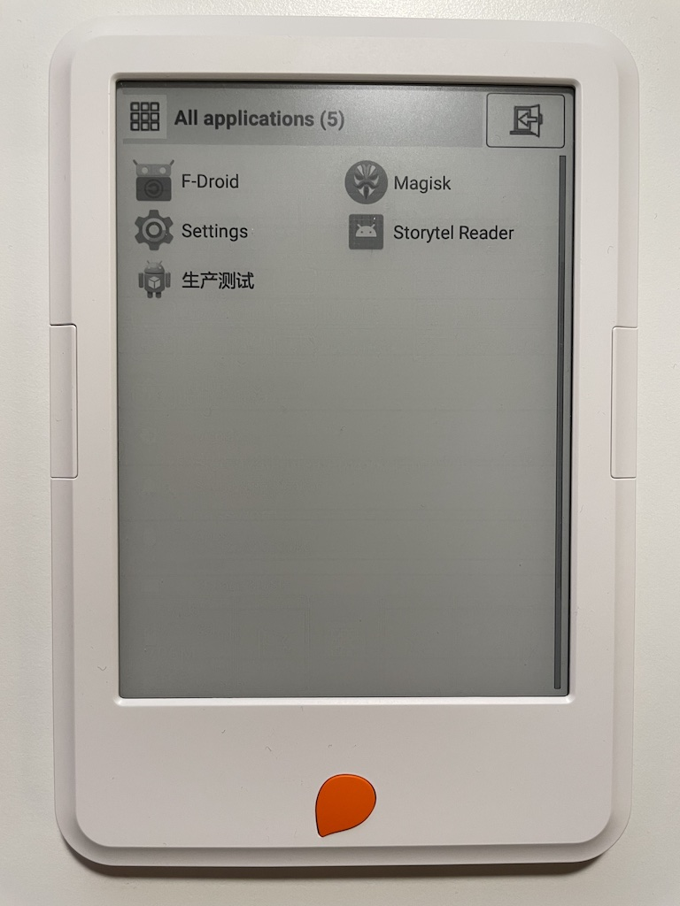
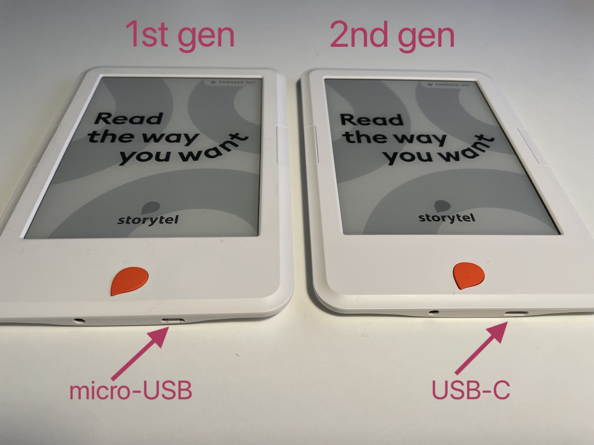
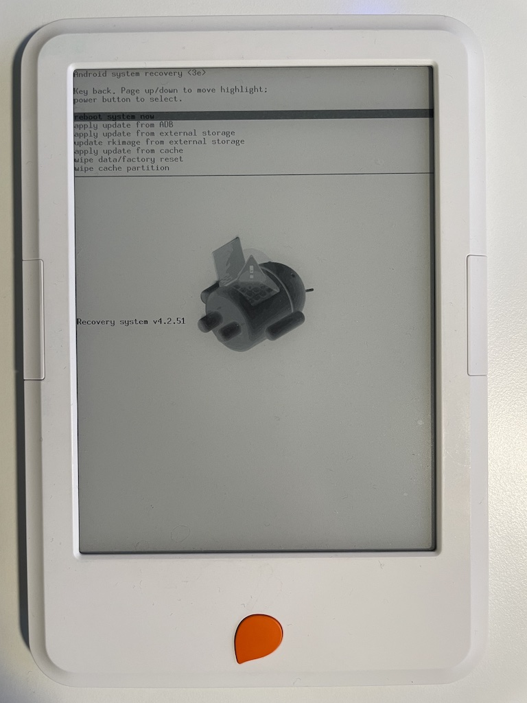
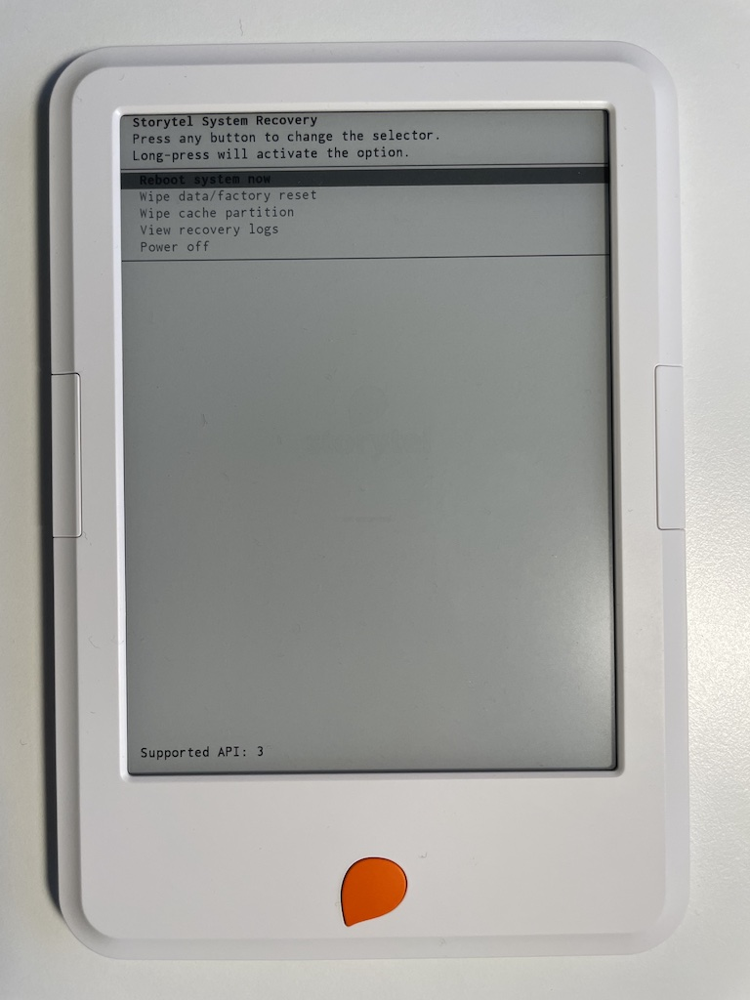
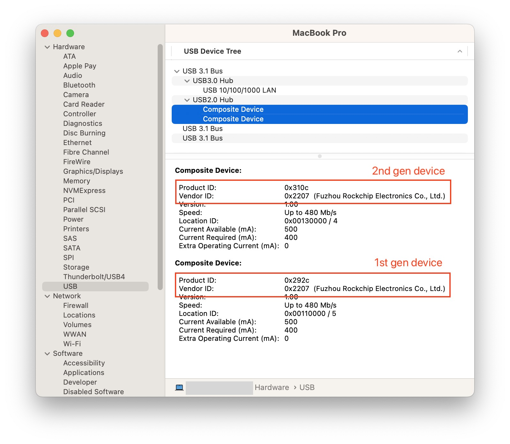
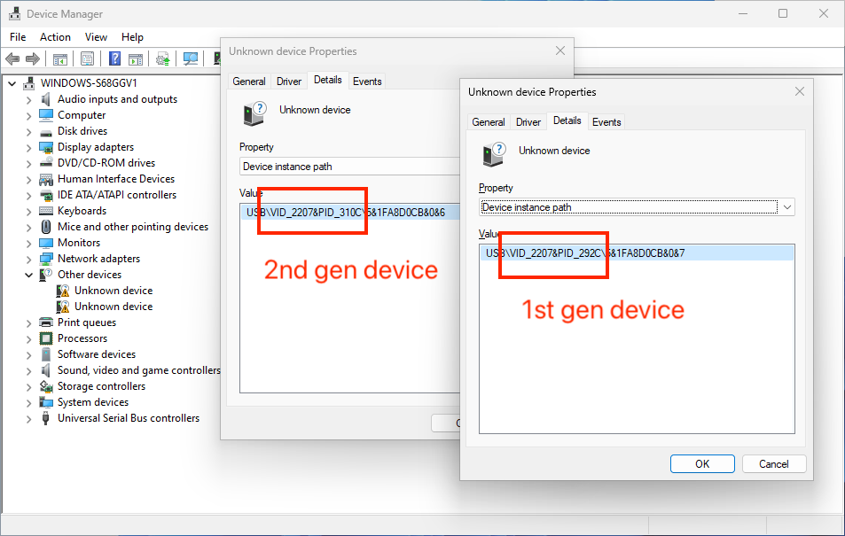
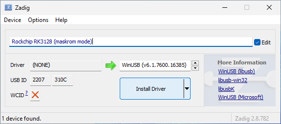

## Introduction

The [Storytel Reader](https://www.storytel.com/reader) device (aka
[Mofibo Reader](https://blog.mofibo.com/mofibo-reader/) in Denmark) is an
Android based [e-book reader](https://en.wikipedia.org/wiki/E-reader) from
Swedish company Storytel AB - providers of the
[Storytel e-book and audiobook subscription service](https://www.storytel.com).
Despite being based on Android, the device only allows one app to be run – the
Storytel app.

***Yeah, that's right, even if you paid €100 for it, you don't really own it –
cancel that Storytel subscription and the device becomes useless.***

This project is an effort to unlock this device, to turn it into a generic
Android E-ink tablet and let you do whatever you want with it.

***You paid for it, so you should own it for real.***

## Quickstart

1. Determine [which version of the device](#versions) you have.
2. Boot your device into [maskrom mode](#maskrom-mode).
3. [Install](#installing-rkflashtool) `rkflashtool`.
4. Backup the `boot` partition:
    ```bash
    rkflashtool r boot > /some/safe/place/boot.img
    ```
    > [!IMPORTANT]
    > BACKUP YOUR `boot` PARTITION!!!
5. Download and flash the patched boot image for your device version:
    ```bash
   # 1st generation device
    curl -OL "https://github.com/ntherning/StorytelReaderMods/releases/latest/download/boot-gen1-patched.img.zip"
    unzip boot-gen1-patched.img.zip
    rkflashtool w boot < boot-gen1-patched.img
   # 2nd generation device
    curl -OL "https://github.com/ntherning/StorytelReaderMods/releases/latest/download/boot-gen2-patched.img.zip"
    unzip boot-gen2-patched.img.zip
    rkflashtool w boot < boot-gen2-patched.img
    ```
6. Reboot the device:
    ```bash
    rkflashtool b
    ```
7. Congratulations! If all worked you should now be able to connect to your
   device via [ADB](https://developer.android.com/tools/adb) and install new
   apps and more. Have a look at the [recipes](#recipes) below for instructions
   on how to install some useful apps.

1st generation Storytel Reader device running F-Droid
[](images/gen1-running-fdroid.jpg)

2nd generation Storytel Reader device running RelaunchX
[](images/gen2-running-relaunchx.jpg)

## Versions

There are two different versions of the Storytel Reader. Physically, from the
outside, they look almost identical apart from the type of USB port they are
equipped with – micro-USB port on the 1st generation device, USB-C on the 2nd
generation device.

[](images/gen1-gen2-identify.jpg)

## Technical specifications

|              | 1st generation                                                                                                                       | 2nd generation                                                                                                                       |
|--------------|--------------------------------------------------------------------------------------------------------------------------------------|--------------------------------------------------------------------------------------------------------------------------------------|
| SoC          | [Rockchip RK3026](https://web.archive.org/web/20161129092652/http://www.rock-chips.com/a/en/products/RK30_Series/2013/0731/371.html) | [Rockchip RK3128](https://web.archive.org/web/20161118024804/http://www.rock-chips.com/a/en/products/RK31_Series/2014/0924/525.html) |
| CPU          | Dual-Core ARM Cortex-A9, XXX GHz                                                                                                     | Quad-Core ARM Cortex-A7, XXX GHz                                                                                                     |
| GPU          | ARM Mali-400MP                                                                                                                       | ARM Mali-400MP                                                                                                                       |
| RAM          | 512 MB                                                                                                                               | 1 GB                                                                                                                                 |
| Storage      | 8 GB eMMC                                                                                                                            | 8 GB eMMC                                                                                                                            |
| Display      |                                                                                                                                      |                                                                                                                                      |
| Connectivity | Wi-Fi                                                                                                                                | Wi-Fi, Bluetooth                                                                                                                     |
| OS           | Android 4.2                                                                                                                          | Android 6                                                                                                                            |

## Origin

Both generations of the device have been manufactured by the
[Chinese company ONYX](https://onyxboox.com) and are most likely rebranded and
slightly customized versions of devices in their
[ONYX BOOX line of products](https://onyxboox.com/product).

## Recovery mode

Both generations can be booted into recovery mode. Unfortunately not much can
be done from the recovery mode in terms of modding. The 1st gen device appears
to support sideloading updates via `adb sideload` but the `update.zip` likely
needs to be signed with a private key which we don't have access to.

The 2nd gen device doesn't seem to support sideloading via recovery at all.

Both devices' recovery menus display options to wipe the `data` (effectively a
factory reset) and `cache` partitions.

### 1st generation

To start the 1st generation Storytel Reader in recovery mode do the following:

1. Make sure the device is powered off (blue LED is turned off) and unplugged
   from USB.
2. Press and hold the orange button below the screen.
3. Press and hold the power button next to the power LED at the top of the
   device.
4. Keep pressing both buttons until "Recovery system ..." is printed on the
   screen. It usually takes about 15 seconds.
5. Your device is now in recovery mode.

[](images/gen1-recovery.jpg)

### 2nd generation

To start the 2nd generation Storytel Reader in recovery mode do the following:

1. Make sure the device is powered off (blue power LED is off) and
   unplugged from USB.
2. Press and hold the orange button below the screen.
3. Connect the device to a wall plugged charger while still holding the
   button. **NOTE**: Do not connect the device to a PC. It will charge but
   depending on the type of cable the device might not enter recovery mode.
4. Keep pressing the button until "Supported API: ..." is printed at the
   bottom of the screen. It may take 10-15 seconds.
5. Your device is now in recovery mode and can be unplugged from the charger.

[](images/gen2-recovery.jpg)

## Maskrom mode

[Maskrom mode](http://rockchip.wikidot.com/how-to-enter-rockusb-maskrom-mode)
is a special feature of the Rockchip SoCs in these devices. It gives us full
control over the flash memory partitioning, lets us backup and reflash
partitions and modify the kernel commandline and other boot parameters. The SoC
will automatically enter maskrom mode if it is unable to find a partition to
boot from. This is a very neat feature as it gives us a last resort if we
accidentally brick the device.

The process to enter maskrom mode is the same on both generations of the
Storytel Reader:

1. Make sure the device is powered off (blue LED is turned off) and unplugged
   from USB.
2. Connect a USB-A data cable to your Mac or PC. It has to be USB-A and the
   other side of the cable must be micro-USB for the 1st gen and USB-C for the
   2nd gen. A USB-C to USB-C data cable does not seem to work for 2nd gen
   devices.
3. Press and hold the orange button below the screen.
4. While pressing the button connect the USB data cable to the device.
5. The blue power LED will light up. Keep pressing the button for a few seconds.

> [!IMPORTANT]
> The display will not react and the device will appear to be powered off. Don't
> worry though, the device will still enter maskrom mode.

### Verify maskrom mode enabled

On **macOS**
use [System Report](https://support.apple.com/guide/mac-help/get-system-information-about-your-mac-syspr35536/mac).
Under *Hardware -> USB* you should see a device with a *Vendor ID* of `0x2207`
and *Product ID* of either `0x292c` (1st gen device) or `0x310c` (2nd gen
device).

[](images/system-report-usb-devices.jpg)

On **Linux** run `lsusb` in a terminal window:

```bash
lsusb
# ID 2207:292c -> 1st gen device
Bus 003 Device 002: ID 2207:292c Fuzhou Rockchip Electronics Company RK3026 in Mask ROM mode
# ID 2207:310c -> 2nd gen device
Bus 003 Device 003: ID 2207:310c Fuzhou Rockchip Electronics Company RK3126/RK3128 in Mask ROM mode
```

On **Windows 10/11** launch *Device Manager* (Win+R shortcut, then type
`devmgmt.msc`). Double-click any *Unknown device* under *Other devices* and
check the *Details* tab. You should find a device with value
`USB\VID_2207&PID_292c&...` (1st gen device) or `USB\VID_2207&PID_310c&...`
(2nd gen device).

[](images/windows-device-manager.png)

## Read/write flash memory partitions

Now that the device is in [mask rom mode](#maskrom-mode) we can use
`rkflashtool` to read and write partitions on the device's flash memory.

### Installing rkflashtool

On **macOS** `rkflashtool` is available via [Homebrew](https://brew.sh/):

```bash
brew install rkflashtool
```

On **Ubuntu** and **Debian** `rkflashtool` is available in the package
repository:

```bash
apt install -y rkflashtool
```

On other **Linux** distributions `rkflashtool` can be built from the sources at
https://github.com/ntherning/rkflashtool.

On **Windows 10/11** (64-bit) a prebuilt `rkflashtool` can be downloaded from
this project. Use [this download link](https://raw.githubusercontent.com/ntherning/StorytelReaderMods/main/tools/windows-x86_64/rkflashtool.exe)
or run `curl` from `cmd.exe`:

```shell
curl -O "https://raw.githubusercontent.com/ntherning/StorytelReaderMods/main/tools/windows-x86_64/rkflashtool.exe"
```

For the remainder of this doc it is assumed that `rkflashtool.exe` is in the
current directory or has been installed to a directory listed in the Windows
`%PATH%` environment variable.

> [!IMPORTANT]
> `rkflashtool` depends on [libusb](https://libusb.info/) (which is
> statically linked into the `.exe` downloaded above). To use libusb on Windows
> a [supported driver](https://github.com/libusb/libusb/wiki/Windows#user-content-Driver_Installation)
> must be installed. WinUSB is recommended and can be installed via
> [Zadig](https://zadig.akeo.ie/).

Here are screenshots of Zadig installing the WinUSB driver for 1st generation
device (`USB ID` is `2207:292C`) and 2nd generation device (`USB ID` is
`2207:310C`). We have also given the devices nice descriptive names by checking
the *Edit* box and entering the new name in the text field. This name will be
shown in *Device Manager*.

[](images/zadig-gen1.png)

[](images/zadig-gen2.png)

### Testing rkflashtool

Once `rkflashtool` has been [installed](#installing-rkflashtool) properly and
`rkflashtool` is in the `$PATH` and a Storytel Reader device is connected in 
[maskrom mode](#maskrom-mode) you should be able to run `rkflashtool p` and get
output similar to:

```bash
# 1st generation device
rkflashtool p

rkflashtool: info: rkflashtool v6.1
rkflashtool: info: Detected RK3026...
rkflashtool: info: interface claimed
rkflashtool: info: reading parameters at offset 0x00000000
rkflashtool: info: size:  0x000002b1
FIRMWARE_VER:4.2.2
MACHINE_MODEL:rk30sdk
MACHINE_ID:007
MANUFACTURER:RK30SDK
MAGIC: 0x5041524B
ATAG: 0x60000800
MACHINE: 3066
CHECK_MASK: 0x80
KERNEL_IMG: 0x60408000
WAV_ADDR:0x7ff00000
RECOVER_KEY: 1,3,30,60,0
PWR_HLD:0,1,A,1,1
CMDLINE:console=ttyFIQ0 androidboot.console=ttyFIQ0 waveform_addr=0x7ff00000 init=/init initrd=0x62000000,0x00800000 mtdparts=rk29xxnand:0x00002000@0x00002000(misc),0x00004000@0x00004000(kernel),0x00008000@0x00008000(boot),0x00010000@0x00010000(recovery),0x00100000@0x00020000(backup),0x000c8000@0x00120000(cache),0x00190000@0x001e8000(userdata),0x00002000@0x00378000(kpanic),0x00100000@0x0037a000(system),-@0x0047a000(user) pcb_ver=2 onyx_emmc=1
```

```bash
# 2nd generation device
rkflashtool p

rkflashtool: info: rkflashtool v6.1
rkflashtool: info: Detected RK312X...
rkflashtool: info: interface claimed
rkflashtool: info: reading parameters at offset 0x00000000
rkflashtool: info: size:  0x00000335
FIRMWARE_VER:6.0.0
MACHINE_MODEL:rk312x
MACHINE_ID:007
MANUFACTURER:RK30SDK
MAGIC: 0x5041524B
ATAG: 0x60000800
MACHINE: 312x
CHECK_MASK: 0x80
KERNEL_IMG: 0x60408000
#RECOVER_KEY: 1,1,0,20,0
CMDLINE:console=ttyFIQ0 androidboot.baseband=N/A androidboot.selinux=permissive androidboot.hardware=rk30board androidboot.console=ttyFIQ0 init=/init initrd=0x62000000,0x00800000 mtdparts=rk29xxnand:0x00002000@0x00002000(uboot),0x00002000@0x00004000(misc),0x00008000@0x00006000(resource),0x00008000@0x0000e000(kernel),0x00010000@0x00016000(boot),0x00010000@0x00026000(recovery),0x0001a000@0x00036000(backup),0x000A0000@0x00050000(cache),0x00002000@0x000F0000(kpanic),0x00300000@0x000F2000(system),0x00008000@0x003F2000(metadata),0x00020000@0x00400000(radical_update),0x00008000@0x00420000(vendor),-@0x00428000(userdata)
```

### Partitions

The `CMDLINE` parameter we get from `rkflashtool p` is the command line used to
initialize the Linux kernel. The `mtdparts` kernel command line parameter
reveals how the device's flash is partitioned. After `mtdparts=rk29xxnand:`
each partition is specified on the format `size@offset(partition_name)` where
`size` is the size of the partition in 512 byte sectors and `offset` is the
offset of the partition from the start of the flash memory, again in 512 byte
sectors.

The 1st generation partition string `0x00100000@0x0037a000(system)` specifies
that there is a partition named `system` at sector `0x0037a000` and with a size
of `0x00100000` sectors, i.e. 512 MB.

The last partition can look like `-@offset(partition_name)` where the `-` size
means that the partition takes up the rest of the space on the flash memory.

#### 1st generation device partitions

| Size       | Offset     | Name     |
|------------|------------|----------|
| 0x00002000 | 0x00002000 | misc     |
| 0x00004000 | 0x00004000 | kernel   |
| 0x00008000 | 0x00008000 | boot     |
| 0x00010000 | 0x00010000 | recovery |
| 0x00100000 | 0x00020000 | backup   |
| 0x000c8000 | 0x00120000 | cache    |
| 0x00190000 | 0x001e8000 | userdata |
| 0x00002000 | 0x00378000 | kpanic   |
| 0x00100000 | 0x0037a000 | system   |
| -          | 0x0047a000 | user     |

#### 2nd generation device partitions

| Size       | Offset     | Name           |
|------------|------------|----------------|
| 0x00002000 | 0x00002000 | uboot          |
| 0x00002000 | 0x00004000 | misc           |
| 0x00008000 | 0x00006000 | resource       |
| 0x00008000 | 0x0000e000 | kernel         |
| 0x00010000 | 0x00016000 | boot           |
| 0x00010000 | 0x00026000 | recovery       |
| 0x0001a000 | 0x00036000 | backup         |
| 0x000A0000 | 0x00050000 | cache          |
| 0x00002000 | 0x000F0000 | kpanic         |
| 0x00300000 | 0x000F2000 | system         |
| 0x00008000 | 0x003F2000 | metadata       |
| 0x00020000 | 0x00400000 | radical_update |
| 0x00008000 | 0x00420000 | vendor         |
| -          | 0x00428000 | userdata       |

## Patching the boot partition

In order to make modifications, such as installing custom apps, we need to
enable [Android Debug Bridge (ADB)](https://developer.android.com/tools/adb)
support on the device. Out of the box the Storytel Reader comes with ADB
disabled via certain properties in the `/system/build.prop` file on the `system`
partition.

One approach to enable ADB would be to use `rkflashtool` to dump the
`system` partition to a file, mount it locally, edit `build.prop` to set
the required properties and then write the modified `system` partition file back
to the flash memory. This is easy enough on Linux as the `system` partition is
formatted using the `ext4` filesystem, native to Linux. On Windows and macOS
`ext4` filesystems are not that easy to mount in writable mode. Furthermore, on
the 2nd generation device which runs Android 6, we also have to make changes to
other partitions in order to circumvent ADB client device authentication (for
some unknown reason the *Allow USB debugging* dialog is never displayed –
there is no way to allow the ADB client to connect).

The approach we will take here is to modify the Linux kernel ramdisk in the
`boot` partition. We will modify the `init.rc` and set the properties which
enable ADB *after* the `/system/build.prop` file is loaded. On 2nd generation
devices we will also patch the ramdisk with
[magisk](https://github.com/topjohnwu/Magisk) to gain full root permission and
be able to use `su` via ADB.

### Required software

We need Git and Python 3 to run the scripts to patch the `boot` partition.

On **macOS** you get Git and Python 3 by installing the Xcode command line
developer tools:

```bash
xcode-select --install
```

Or alternatively one can use [Homebrew](https://brew.sh/):

```bash
brew install git python3
```

On **Linux** Git and Python 3 should be available in your distribution's
package repository. E.g. on Ubuntu and Debian:

```bash
apt install -y git python3
```

On **Windows 10/11** download and install [Git](https://git-scm.com/download/win) and
[Python 3](https://www.python.org/downloads/windows/). Both are available via
[winget](https://learn.microsoft.com/en-us/windows/package-manager/winget/).
Make sure `git.exe` and `python3.exe` is in your `PATH`.

### Patching the boot partition

Clone this repository using `git`:

```bash
git clone https://github.com/ntherning/StorytelReaderMods.git
cd StorytelReaderMods/
git submodule init
git submodule update
```

#### Patching 1st generation boot partition

Run `tools/repack.py` to patch the `boot` partition from a **1st generation**
device:

```bash
cd StorytelReaderMods/
mkdir tmp
rkflashtool r boot > tmp/boot.img
python3 tools/repack.py --boot_img tmp/boot.img --out_img tmp/boot-gen1-patched.img --mods_dir mods/gen1/
```

#### Patching 2nd generation boot partition

Run `tools/repack.py` to patch the `boot` partition from a **2nd generation**
device:

```bash
cd StorytelReaderMods/
mkdir tmp
rkflashtool r boot > tmp/boot.img
python3 tools/repack.py --boot_img tmp/boot.img --out_img tmp/boot-gen2-patched.img --mods_dir mods/gen2/
```

## Recipes

Here are instructions for installing some nice to have apps on your Storytel
Reader.

### F-Droid

[F-Droid](https://f-droid.org) is an alternative to Google Play Store for
installing FOSS (Free and Open Source Software) apps. Unfortunately the latest
version is not compatible with the 1st generation Storytel Reader as it runs
Android 4.2.2 – insteal we have to use the last version compatible version.

1st generation:
```bash
curl -O "https://f-droid.org/F-Droid.apk"
adb install F-Droid.apk
# Launch F-Droid
adb shell monkey -p org.fdroid.fdroid -v 1
```

2nd generation:
```bash
curl -O "https://f-droid.org/archive/org.fdroid.fdroid_1012051.apk"
adb install org.fdroid.fdroid_1012051.apk
# Launch F-Droid
adb shell monkey -p org.fdroid.fdroid -v 1
```

### RelaunchX

Once [F-Droid](#f-droid) is installed you can use it to install
[RelaunchX](https://f-droid.org/en/packages/com.gacode.relaunchx/) – a launcher
targeted at devices with E-Ink displays.

### KOReader

[KOReader](https://f-droid.org/en/packages/org.koreader.launcher.fdroid/) is
an Ebook reader with support for many formats like PDF, DjVu, EPUB, FB2, CBZ. It
is available via [F-Droid](#f-droid).
